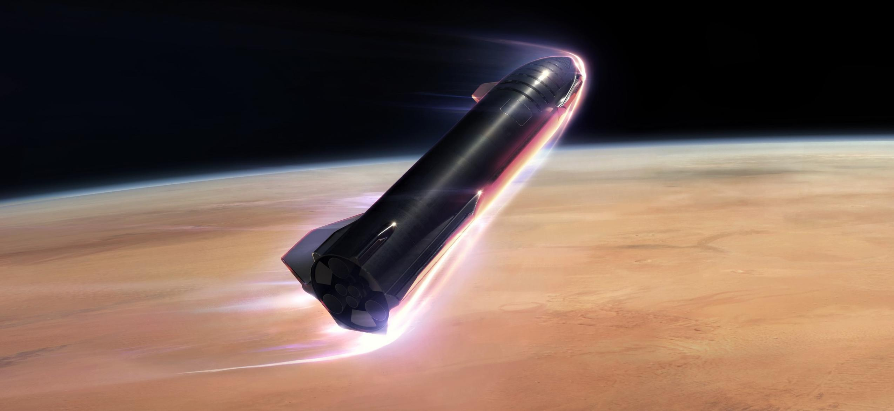

### n-body_sim.ipynb

Classic n-body simulation. O(N^2) version. Very simple to implement.

### reentry_sim.ipynb

Simulating Martian EDL. What will happen when a spacecraft enters, descends and lands (or crashes) on Mars? We take into account the variation in Martian atmospheric density with altitude. I've used data from  paper (page 4/19). Simulation returns various parameters of the spacecraft at a desired point.

### lunarss_sim.ipnb

How much payload can Starship shuttle b/w the Earth and the Moon? The relationship b/w LEO->Moon payload and Moon->LEO payload is linear and I've shown why.

