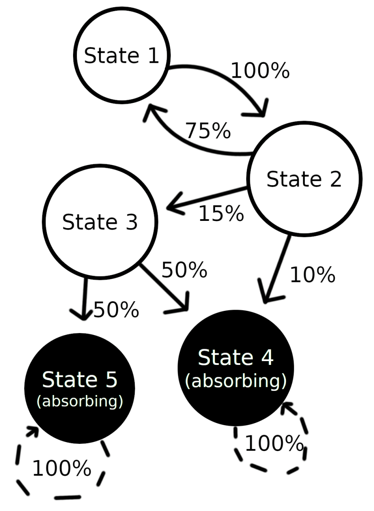

### Markov Chains
A Markov chain is a stochastic model describing a sequence of possible events in which the probability of each event depends only on the state attained in the previous event. They are represented using directed graphs.

### Uses of Markov chains
"...depends only on the state attained in the previous event..." - this is an important point. A lot of real world scenarios can be described in the form of a Markov Chain. Such a scenario (or process) is described as Markovian. Sometimes, the state space is so HUGE, that modelling the scenario using Markov chains is intractable. For example, consider an AI agent trying to learn a policy for a game (say, Atari Pacman). Each state is a node in a directed graph. If there are 4 possible actions the agent could take (up, down, left or right) then each node will have an out degree of 4 (except for terminal nodes - the game ends at a terminal node). A good policy is the set of actions that an agent should take to get a high reward. A policy is simply a path through the directed graph. We need to find the optimal policy (the optimal path) so we can get a high reward. But modelling Pacman as a Markov chain is impossible. Each state is a node and there are a HUUUUUGEEE number of possible states. What we do is use some kind of function approximator (say, a neural network) to find an approximately good policy. 
 
